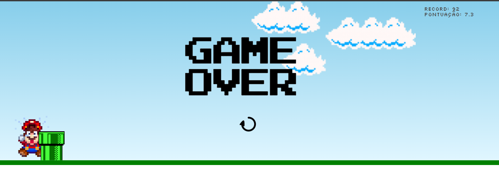

<h1 align="center"> Mario Game </h1>

  <a href="#-tecnologias">Technologies</a>&nbsp;&nbsp;&nbsp;|&nbsp;&nbsp;&nbsp;
  <a href="#-projeto">Project</a>&nbsp;&nbsp;&nbsp;|&nbsp;&nbsp;&nbsp;
  <a href="#memo-licença">License</a>&nbsp;&nbsp;&nbsp;|&nbsp;&nbsp;&nbsp;
  <a href="#readme-in-portuguese">README in Portuguese</a>

 

  

 

  

## 🚀 Technologies
This project was developed with the following technologies:

- HTML
- CSS
- JavaScript
- Git and Github

## 💻 Project

Mario Game is a game where you can jump over obstacles. The game ends when you collide with an obstacle. The game is similar to Google's dinosaur game.

## :memo: License
This project is under the MIT license.

by Hugo Bertoncelo